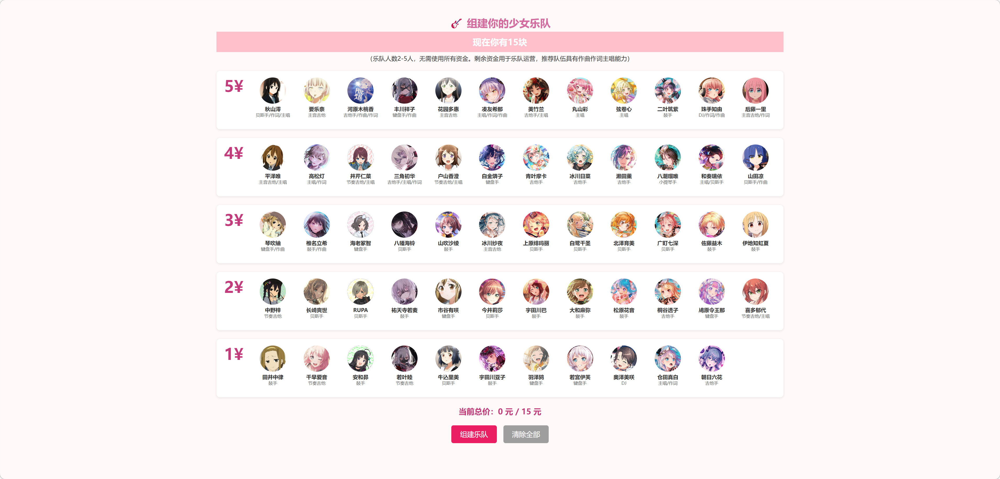
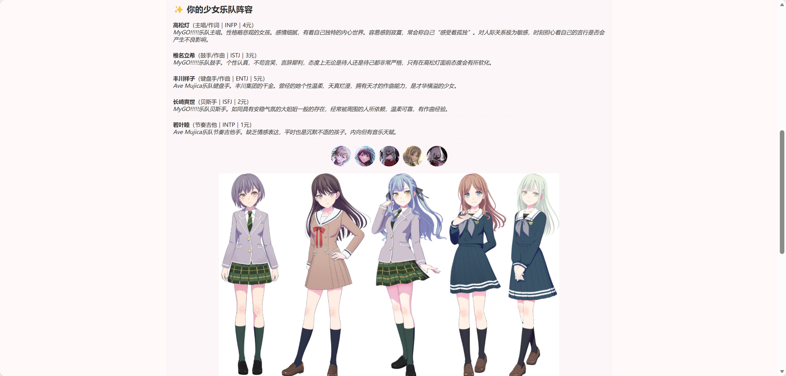
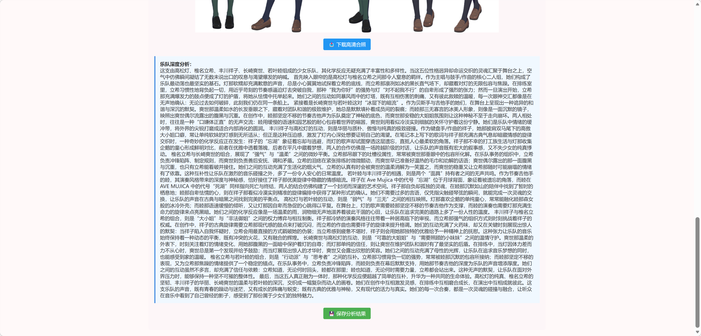

# 15元组建你的少女乐队！

[](https://opensource.org/licenses/Apache-2.0)

## 效果预览





<p align="center">
  <em>系统自动生成乐队成员合照和评价</em>
</p>

## 项目简介

**15块钱组建你的少女乐队！** 是一个开放组合工具，允许用户组建属于自己的少女乐队。


## 项目文件说明

### 文件

- **data/character_knowledge.json**：少女角色知识库，可自行定义和微调角色人格和社交关系
- **image/**：存放乐队少女角色头像
- **picture/**：存放乐队少女全身像

## 版权声明

角色知识库部分内容引自萌娘百科(https://zh.moegirl.org.cn )，文字内容默认使用《知识共享 署名-非商业性使用-相同方式共享 3.0 中国大陆》协议。

## 快速开始

### 环境要求

- 现代浏览器（Chrome / Firefox / Edge）
- Visual Studio Code（安装Live Server插件）

### 使用步骤

```bash
# 1. 下载项目

# 2. 新增自己喜欢角色的头像
image

# 3. 新增自己喜欢角色的全身像
picture

# 4. 根据自己的喜好编辑人物知识库
data/character_knowledge.json

# 5. 从Visual Studio Code打开html文件
15块钱组建你的少女乐队.html 右键 open with live server
